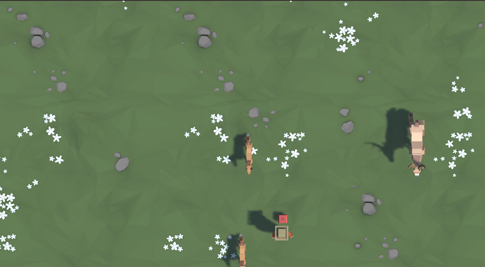

# Hungry Animal Rescue

## Overview

This project was created as part of an official Unity course with a focus on creating a dynamic and engaging top-down game experience. In this game, players prevent hungry animals from stampeding past by skillfully throwing food, similar to the gameplay dynamic seen in "Space Invaders."